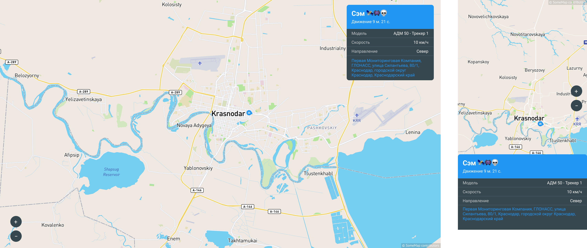
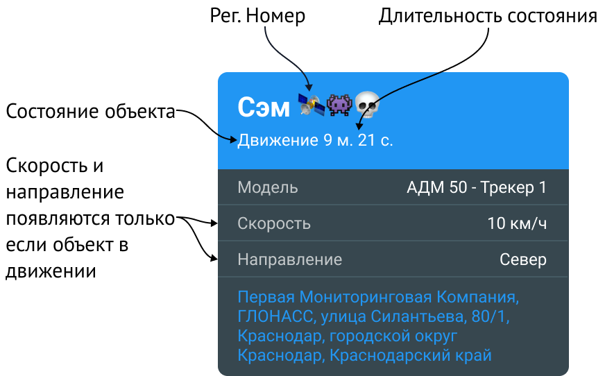

# Waliot Share Client

Репозиторий с реализацией одного и того же приложения на разных фреймфорках.



[Дизайн приложения в Figma](https://www.figma.com/file/jJKeAQAErwnU9eoye9D2mM/WaliotShareClient?node-id=0%3A1)

## Техническое задание

### Описание

Пользователь получает ссылку открыв, которую может следить за объектом. В приложении на карте отображается текущее местоположение объекта мониторинга, а так же его доп. данные: статус, рег. номер и тд.

### Требования

- Всегда держать объект в центре экрана, если пользователь отодвинул карту, то при обновлении данных вернуть его обратно в центр
- Данные обновляются **каждые 15 секунд** путем интервального создания запросов по пути `https://api.waliot.com/api/states/share/tracking-objects/:token` - где параметр `token`,
уникальная строка, позволяющая получить данные по конкретному объекту.

  Возвращаемая модель имеет вид:
  ```typescript
  interface ShareTrackingObject {
    /**
     * Направление движения в градусах относительно севера по часовой стрелке,
     * от 0 до 360 градусов
     */
    course: number
  
    /**
     * Широта, в десятичной форме
     */
    latitude: number
  
    /**
     * Долгота, в десятичной форме
     */
    longitude: number
  
    /**
     * Модель объекта мониторинга
     */
    model: string
  
    /**
     * Регистрационный номер объекта мониторинга
     */
    regNumber: string
  
    /**
     * Текущая скорость, км/ч
     */
    speed: number
  
    /**
     * Время начала текущего состояния
     * из поля {@link ShareTrackingObject#stateType}, в ISO8601
     */
    stateStart: string
  
    /**
     * Тип текущего состояния
     */
    stateType: "OFFLINE" | "ONLINE" | "PARKING" | "STOP" | "LOW_SPEED" | "NORMAL_SPEED" | "OVER_SPEED"
  
    /**
     * Идентификатор объекта мониторинга
     */
    trackingObjectId: number
  }
  ```

  Поле «Модель» должно отображаться всегда, логика остальных полей, указана ниже на схеме:

  

- В заголовках запроса нужно передавать название приложения и его версию:
  
  ```text
  X-Waliot-App-Name: SHARE_CLIENT_ON_SVELTE
  X-Waliot-App-Version: 1.2.3
  ```

- Токен доступа, должен быть указан в URL-е приложения. В случае его отсутсвия, приложение выводит диалог об его отсутсвии
- Если запрос упал, то нужно вывести диалог об ошибке. В случае ошибки с кодом 404 вывести сообщение "Токен не найден", если 403, то "Токен истёк"
- Так же вместе с запросом на получение данных, после него нужно сделать запрос на геокодер OpenStreeMap для получения человеко-читаемого адресса. Для его получения используется [OpenStreetMap API](https://nominatim.openstreetmap.org/ui/reverse.html).

  API запрос делается по пути `https://nominatim.openstreetmap.org/reverse` и передаются следующие query-параметры:

  ```text
  lat=45.989
  lon=45.989
  zoom=100
  addressdetails=1
  accept-language=ru
  format=json
  ```

  Описание параметров и то что они значат вы можете найти в [документации](https://nominatim.org/release-docs/develop/api/Reverse/). Возвращаются данные вида:

  ```typescript
  interface GeocoderAddress {
    building?: string
    house?: string
    public_building?: string
    city?: string
    street?: string
    street_number?: string
    village?: string
    town?: string
    city_district?: string
    country?: string
    country_code?: string
    county?: string
    house_number?: string
    postcode?: string
    region?: string
    road?: string
    state?: string
  }

  interface GeocoderResponse {
    address: GeocoderAddress
    boundingbox: string[]
    display_name: string
    lat: string
    lon: string
    licence: string
    osm_id: number
    osm_type: string
    place_id: number
  }
  ```

## Таблица сравнения фреймворков

| Фреймворк | Вес, кб | Время сборки, сек | Событие "load", сек | Событие "DomContentLoaded", сек |
|--|--|--|--|--|
| [Angular](angular.io) | 605 | ~24 | 0.806 | 1.48 |
